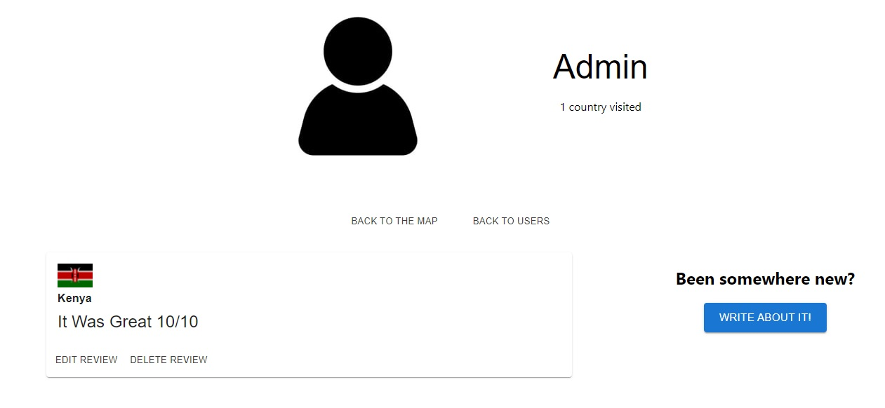

# Adventure Map!

## Description

This project was assigned at the end of the ninth week of General Assembly’s 3-month SEI (Software Engineering Immersive) course, in which I studied the fundamentals of software engineering with the aim to launch a career in this sector. The aim of the project was to design a full stack app from scratch within one week, working in groups of three. My group was myself, Nathan and Sam.

## Deployment link
https://codebyjetmap.netlify.app/

----

## Technologies Used: 
To complete this project I used:
 - JavaScript | Express for the back-end
 - JavaScript and React for the front.
 - using MUI for styling

## Setup:
Clone both repos locally, then open them in VS code, using:
‘code .’
Then:
- For the backend, run: npm run dev
- For the frontend, run: npm start

Backend Repo - https://github.com/CodebyJet/GA-Project-3-BackEnd
Frontend Repo - https://github.com/CodebyJet/GA-Project-3-Frontend

## Brief:
With this project, we were given the brief to build a full stack app, the app could be of our own choice, as long as it was:
- A MERN stack app
- used authentication
- at least two models on the back end
- multiple components on the front end.
---

## Planning:
The first day of the project, as a group, be brainstormed possible ideas. These ranged from:
- a shopping list 
- a messaging board, like myspace
We settled on the idea of having a hybrid travel app. Users could register and write posts about the countries they had visited - and as the amount of comments on a country increased, it would change colour on a world map.

## The tasks
Before we all jumped into it, we looked to see if there was any react components that would do the effect we were after. Luckily there was, and we went with React Simple Maps.
Next we sketched out what functions and components we believed we would need, and made a Trello board to divide the tasks up.

## Stage 1: The backend
With the tasks divided up, and a rough idea in motion. We started work on the back end. I created the index.js and the helpers.js, this was a simple start server function, connecting to Monogdb - As the project went on this was expanded to use CORS and express.json.

## Stage 2: The User and Secure Route
The user model was fairly straight forward too, it's fairly boilerplate in design, the user signs up with a unique email address, and it has space on the schema for the countries they have visited and the 'entries' they have written about those countries

After the schema was made, I made the controllers for the user - Logging in, registering, deleting and updating - I also wanted the ability to be able to search for users, so you could see where others have been and what entries they made.

The secure route was very boiler plate also - I wanted users to only be able to write posts, if they were signed in.

----
As these were being made, Sam made the countries controller and schema, and Nathan created the entries controllers and schema.

## Stage 3: Testing and creating the seed file
In postman, these were all tested - could we register and login, and could we write about countries.
As these were tested, we created a simple seed file in the backend, this was later updated with more users and all of the countries (I found an array of all the countries and their codes online)
With this in place, most of the backend was finished for now.

## Stage 4: The frontend
We created another repo for the front:
- First tasks was a simple 'Home' screen
- Then we created the api and auth files
We tested out the api calls, and for now printed to the console the countries to test that is was connecting to the database - This is were I installed CORS to the backend.

## Stage 5: Register and login front end
I worked on creating the pages to register and login, while Sam worked on creating the ability to make entries about the countries and Nathan read the documentation on the React Simple Maps - these turned out to be not so simple.

## Stage 6: NavBar and userpage
With the ability to register and login tested and working on the frontend,  I created a simple user page - it would display the user profile picture, and later would show the entries they had made. Sam made a simple navbar so we could navigate easier. 

As a group, we then merged all we had done and resolved all merge conflicts.

## Stage 7: Country page
I created the page to display individual countries, here is where we encountered the first 'bug' of team working. I wanted to implement the create entries that had been made, on the individual country pages, so while you were on the country, you could write about it.

This is were I learnt the importance of a **more thorough stand up**. The creating entries hadn't been tested on the front end, and the original one, was just a lifted MUI component. This caused a fair amount of delay to the project, as now I had to correct and fix this component.
After this, all stand up as a group, explained more what we had done and if it was tested.

While I worked on the creating entries, Sam made the search bar, so you can search for the users and navigate to their page.

## stage 7: Implementing the map:
While I was fixing the component, Nathan was working on creating the map page, and navigating to the continent and individual countries. It turns out the React Simple Maps hadn't been updated for a while, our fault as a group for not seeing this, and another learning lesson. We still decided to use the react component, but it did mean a few future features we wanted to write in, we couldn't, as we had to use an older version on Node.

## Stage 8: Simple styling
This bit was slightly rushed, as we lost time fixing some components and getting the map to work.

## Wins?
Overall, my biggest win from the project, was just working through the bugs we had, and solving them.

## Future Improvements:
In future iterations, I would to implement a carousel effect on the home page, so go through entries people had made about countries. Also rather than just the flag of the country, if there is a database of just some nice scenic views from that country, would be nicer.